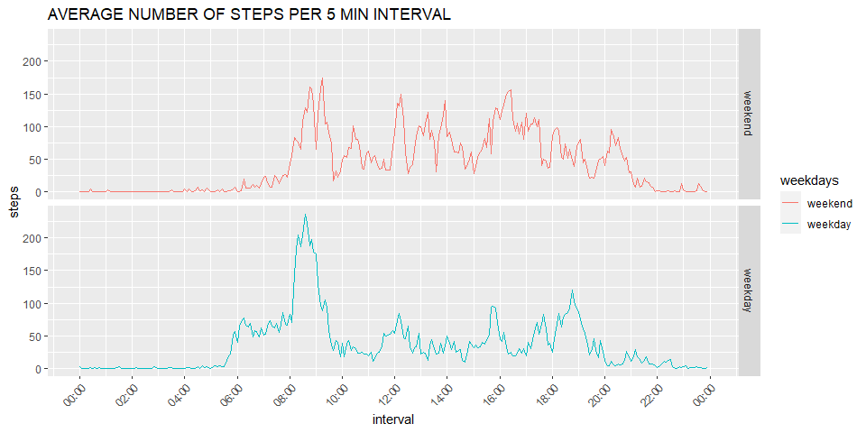

Introduction
============

It is now possible to collect a large amount of data about personal
movement using activity monitoring devices such as a Fitbit, Nike
Fuelband, or Jawbone Up. These type of devices are part of the
“quantified self” movement – a group of enthusiasts who take
measurements about themselves regularly to improve their health, to find
patterns in their behavior, or because they are tech geeks. But these
data remain under-utilized both because the raw data are hard to obtain
and there is a lack of statistical methods and software for processing
and interpreting the data.

This assignment makes use of data from a personal activity monitoring
device. This device collects data at 5 minute intervals through out the
day. The data consists of two months of data from an anonymous
individual collected during the months of October and November, 2012 and
include the number of steps taken in 5 minute intervals each day.

First, let’s download the data and save it in your working derictory.
We’ll read it into activity dataframe. The following code will do it.

    wd<-getwd()
    temp<-tempfile()
    file1<-paste0(wd,"/activity.csv")
    fileURL<-"https://d396qusza40orc.cloudfront.net/repdata%2Fdata%2Factivity.zip"

    if (!file.exists(file1))
        {
           download.file(fileURL,temp)
           unzip(temp)
           unlink(temp)
        }
     if ("activity.csv" %in% dir()) activity <- read.csv("activity.csv")

### Histogram of the total number of steps taken each day

    library(ggplot2)
    library(dplyr)

    ## 
    ## Attaching package: 'dplyr'

    ## The following objects are masked from 'package:stats':
    ## 
    ##     filter, lag

    ## The following objects are masked from 'package:base':
    ## 
    ##     intersect, setdiff, setequal, union

    activity$date<-as.Date(activity$date)
    gr<-activity%>%group_by(date)%>%summarise(steps=sum(steps))

    ggplot(gr, aes(x = steps))+
            geom_histogram(binwidth = 5000)+
            ylim(0,25)+
            labs(title = "TOTAL NUMBER OF STEPS EACH DAY")

    ## Warning: Removed 8 rows containing non-finite values (stat_bin).

### Mean and median number of steps taken each day

Lets’s calculate mean and median number of steps taking each day. We’ll
group dataframe by date first.

    library(dplyr)
    gr_activity<-activity%>%
                        group_by(date)%>%
                            summarise(tot.steps=sum(steps,na.rm = TRUE))
    print(paste("the mean is" , mean(gr_activity$tot.steps, na.rm = TRUE)))

    ## [1] "the mean is 9354.22950819672"

    print(paste("the median is" , median(gr_activity$tot.steps, na.rm = TRUE)))

    ## [1] "the median is 10395"

### Time series plot of the average number of steps taken

    activity$interval <- as.POSIXct(paste(sprintf("%04.0f", activity$interval)), format='%H%M')
    ggplot(aes(x = interval, y = steps),data=activity%>%group_by(interval)%>%summarise(steps=mean(steps,na.rm = TRUE)))+
          theme(axis.text.x = element_text(angle = 45, hjust = 1))+
            labs(title = "AVERAGE NUMBER OF STEPS")+
            geom_line(col = "blue")+
            geom_point(shape=16, col="blue", size=1)+
            scale_x_datetime(date_breaks = "2 hours", date_labels = "%H:%M")

### The 5-minute interval that, on average, contains the maximum number of steps

Let’s group by interval and avg. the steps.

    grint<-activity%>%group_by(interval)%>%summarise(steps=mean(steps, na.rm = TRUE))

    print(paste('the 5-minute interval',strftime(grint$interval[which(as.logical(grint$steps==max(grint$steps)))],format="%H:%M"), "contains the maximum number of steps on average",max(grint$steps)))

    ## [1] "the 5-minute interval 08:35 contains the maximum number of steps on average 206.169811320755"

### Code to describe and show a strategy for imputing missing data

The below code will utilize the following strategy. We will group the
dataframe by day of the week and by interval. We will calculate mean of
steps in the grouped dataframe and impute the misiing values.

    activity$weekdays<-weekdays(activity$date)
    impdata<-activity%>%
                group_by(weekdays,interval)%>%
                    summarise(imp.steps=mean(steps, na.rm = TRUE))

    ## `summarise()` has grouped output by 'weekdays'. You can override using the `.groups` argument.

    mactivity<-merge(activity,impdata, by=c("weekdays","interval"), all=TRUE)
    mlog<-as.logical(is.na(mactivity$steps))
    mactivity$steps[which(mlog)]<-mactivity$imp.steps[which(mlog)]
    mactivity<-select(mactivity,"steps","interval","date","weekdays")
    gr<-mactivity%>%group_by(date)%>%summarise(steps=sum(steps))
    ggplot(gr, aes(x = steps))+
            geom_histogram(binwidth = 2000)+
            ylim(0,25)+
            labs(title = "TOTAL NUMBER OF STEPS EACH DAY IMPUTED")

\#\#\# LET’S CALCULATE MEAN AND MEDIAN OF THE IMPUTED DATA

    gr_mactivity<-mactivity%>%
                        group_by(date)%>%
                            summarise(tot.steps=sum(steps,na.rm = TRUE))
    print(paste("the mean is" , mean(gr_mactivity$tot.steps, na.rm = TRUE)))

    ## [1] "the mean is 10821.2096018735"

    print(paste("the median is" , median(gr_mactivity$tot.steps, na.rm = TRUE)))

    ## [1] "the median is 11015"

### Panel plot comparing the average number of steps taken per 5-minute interval across weekdays and weekends

Let’s convert weekdays to 2 factor variable and group the dataframe by
interval

    #create a vector of weekdays
    weekdays1 <- c('Monday', 'Tuesday', 'Wednesday', 'Thursday', 'Friday')
    #Use `%in%` and `weekdays` to create a logical vector
    #convert to `factor` and specify the `levels/labels`
    mactivity$weekdays <- factor((weekdays(mactivity$date) %in% weekdays1),levels=c(FALSE, TRUE),labels=c('weekend', 'weekday'))
    data<-mactivity%>%group_by(interval,weekdays)%>%summarise(steps=mean(steps,na.rm = TRUE))

    ## `summarise()` has grouped output by 'interval'. You can override using the `.groups` argument.

    #building plot

    dplot<-ggplot(aes(x=interval, y = steps, color=weekdays),data=data)
    dplot+geom_line()+facet_grid(rows=vars(weekdays))+labs(title = "AVERAGE NUMBER OF STEPS PER 5 MIN INTERVAL")+
         scale_x_datetime(date_breaks = "2 hours", date_labels = "%H:%M")+
            theme(axis.text.x = element_text(angle = 45, hjust = 1))

